# TL;DR
This repository contains code to turn your Kali Linux machine into a router
that
- records all traffic with wireshark
- sends HTTP and HTTPS traffic to an intercepting proxy, such as BurpSuite, running on another machine.

Read [Setup](#setup) and [Automation](#automation) to configure your Kali Linux machine and run the scripts.

Read [A Raspberry Pi Kali Router](#a-raspberry-pi-kali-router) if you want to run this on a Raspberry Pi.

We assume that you own an [ Ethernet LAN Network USB Adapter](https://www.amazon.com/Plugable-Gigabit-Ethernet-Network-Adapter/dp/B00AQM8586) and a [wireless B/G/N USB adapter](https://www.amazon.com/gp/product/B004Y6MIXS/ref=oh_aui_detailpage_o00_s00?ie=UTF8&psc=1).

# Intercepting IP traffic for any device, app, or application

- [TL;DR](#tldr)
- [Intercepting IP traffic for any device, app, or application](#intercepting-ip-traffic-for-any-device-app-or-application)
	- [Introduction](#introduction)
	- [Setup](#setup)
	- [Configuring Kali Linux as a Router](#configuring-kali-linux-as-a-router)
		- [Ethernet](#ethernet)
		- [Wi-Fi Data Link Layer](#wi-fi-data-link-layer)
		- [Network Configuration](#network-configuration)
		- [Network Services](#network-services)
	- [Sniffing and Intercepting Traffic](#sniffing-and-intercepting-traffic)
	- [Automation](#automation)
	- [Intercepting Communication from Embedded Devices, Android Apps, and Windows Applications](#intercepting-communication-from-embedded-devices-android-apps-and-windows-applications)
		- [Embedded Device](#embedded-device)
		- [Mobile Applications](#mobile-applications)
		- [Windows Applications](#windows-applications)
	- [A Raspberry Pi Kali Router](#a-raspberry-pi-kali-router)
	- [Conclusion](#conclusion)
	- [References](#references)


## Introduction
Many of us regularly sniff or intercept traffic coming from embedded devices, mobile apps, or windows applications. For devices or applications that are proxy-aware, interception of traffic is straightforward: we configure the application or device to use our [proxy](https://en.wikipedia.org/wiki/Proxy_server), such as [BurpSuite](https://portswigger.net/burp), and go on with our lives. For devices or applications that are not [proxy-aware](https://docstore.mik.ua/orelly/networking_2ndEd/fire/ch09_02.htm), intercepting traffic is  more challenging.

In this article, we describe how to set up [Kali Linux](https://www.kali.org/) to sniff [TCP](https://en.wikipedia.org/wiki/Transmission_Control_Protocol)/[UDP](https://en.wikipedia.org/wiki/User_Datagram_Protocol) traffic of any device, app, or application by configuring Kali as an intercepting router that can forward specific traffic to a transparent proxy on a different machine, such as HTTP(S) traffic to BurpSuite. Situations where an intercepting router is useful include complex scenarios where many devices and applications interact with each other, such as an embedded device that interacts with a web service, but that can also be configured via a mobile and a windows application. To maximize portability, we implement the above set-up on a Raspberry Pi.

## Setup
We configure Kali Linux as a proxy-aware router. Clients, such as embedded devices or mobile apps, make connections to their servers as they normally would, but interesting packets (e.g. HTTP and HTTPS packets) are intercepted by our Kali Linux machine and redirected to a proxy server (e.g. BurpSuite). All traffic passing through our router is monitored with [Wireshark](https://www.wireshark.org/). Both our Kali Linux machine and BurpSuite act as a transparent proxy as the clients are not aware of their existence. The main advantage of this set-up is that it reduces the configuration of the clients to a minimum. This setup is illustrated in the figure below.

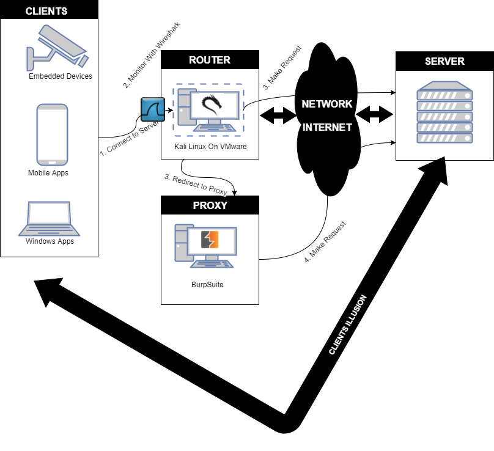

Before configuring our Kali Linux machine, we need to configure VMWare and our network interfaces as follows.
- We connect our Kali Linux machine running within [VMWare](https://www.vmware.com/) to the network in bridged mode so that it is directly connected to the network the device/application/mobile phone that we want to monitor would normally connect to.
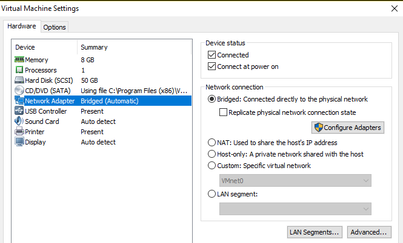
- We connect two adapters (Ethernet and WiFi) and give the USB connections to Kali. In the figure below, our adapters are the [Ethernet LAN Network Adapter ASIX AX88179](https://www.amazon.com/Plugable-Gigabit-Ethernet-Network-Adapter/dp/B00AQM8586) and the [wireless B/G/N USB adapter Atheros UB91C](https://www.amazon.com/gp/product/B004Y6MIXS/ref=oh_aui_detailpage_o00_s00?ie=UTF8&psc=1). For WiFi, we could have used any adapter that is compatible with [Linux](http://www.wirelesshack.org/best-kali-linux-compatible-usb-adapter-dongles-2016.html), as long as it supports promiscuous mode.


The subsequent sections elaborate how we configure our Kali Linux machine as a router and how we monitor devices and applications by connecting them to the Kali Linux router.

## Configuring Kali Linux as a Router
Our Kali Linux machine will route traffic from the plugged in USB network interfaces (Ethernet and WiFi) to its own Internet connection and vice versa. Creating a router consists of four main parts.
- Setting up the **Ethernet layer** so that wired clients can connect to Kali's interface.
- Setting up the **Wi-Fi data link layer**, so that wireless clients can connect to Kali's "software access point" and send/receive IP packets from/to Kali.  We use the ```hostapd``` application to do this. We bridge both the wired interface as well as the access point so that the machines connected to them are part of the same network (so that we can monitor a multi-device set-up such as an embedded device connected via Ethernet communicating with a mobile application, a Windows application, and the Internet).
- Setting up the **network configuration** on our Kali Linux machine, so that it properly relays IP packets from its own Internet connection to its connected clients (and vice versa).
- Adding **network services** such as DNS and DHCP so that clients get assigned IP addresses and can resolve domain names. We can use the DNS network service to redirect any domain name to a machine under our control.

Before we execute the aforementioned steps, we will need to figure out what interfaces the adapters show up as. To do so, we execute ```ifconfig``` on our Kali Linux machine before and after we connect the adapters.
```shell
$ ifconfig -a
```
Our Ethernet adapter will typically show up as ```eth1``` while our WiFi adapter will typically show up as ```wlan0```. (```eth0``` is the interface that is configured by VMWare to give Kali access to the Internet).

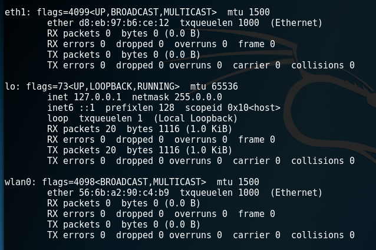

We tell the [network-manager](https://wiki.gnome.org/Projects/NetworkManager) service that we will manage the interfaces ourselves by adding the adapters MAC addresses to the unmanaged-devices section of the ```/etc/NetworkManager/NetworkManager.conf``` file.

```
[keyfile]
unmanaged-devices=mac:d8:eb:97:b6:ce:12;mac:56:6b:a2:90:c4:b9
```

We restart the networking service so that the devices become unmanaged.
```shell
$ /etc/init.d/networking restart
```

### Ethernet
Before we create our monitoring network, we select an appropriate network and network mask. Using a different network range than the one of the network our Kali Linux machine connects to (via `eth0`) ensures that the IP addresses of our monitored devices do not clash with IP addresses used on the main network. We select the ```172.16.0.0/12``` network, as our main network interface (```eth0```) typically receives a ```10.0.0.0/8``` (corporate) or a ```192.168.0.0/16``` (home) network address.

As we want our wireless and wired network to be part of the same network, we create a bridge between them with the [```bridge-utils```](https://help.ubuntu.com/community/NetworkConnectionBridge) tool.
```shell
$ apt-get install bridge-utils
```
We then delete any IP address assigned to our wired interface ```eth1```.
```shell
$ ip addr flush dev eth1
```
We create a bridge interface named ```br0```.
```shell
$ brctl addbr br0
```
We add our wired interface ```eth1``` to the bridge interface ```br0```.
```shell
$ brctl addif br0 eth1
```
We bring the bridge interface ```br0``` up.
```shell
$ ip link set dev br0 up
```
We assign it an IP address in the network that we selected. As it is a gateway for our monitored devices, we chose  ```172.16.0.1```.
```shell
$ ip addr add 172.16.0.1/12 dev br0
```

### Wi-Fi Data Link Layer
After configuring the Ethernet interface, we create a wireless access point with the [```hostapd```](https://w1.fi/hostapd/) program. We first install it with apt-get.

```shell
$ apt-get install hostapd
```
We then create its configuration file ```hostapd.conf``` with the following information.
```
# create a wireless network with this interface; change it if your wireless card is not wlan0
interface=wlan0
# change this if a different bridge interface was chosen
bridge=br0
# the name of our wireless network
ssid=Monitor-Network
# Change the passphrase to something you like
wpa_passphrase=Monitor-Network
# the driver used
driver=nl80211
auth_algs=3
# the wireless channel we listen on.
channel=7
driver=nl80211
# the mode we use (g)
hw_mode=g
# we don't log
logger_stdout=-1
logger_stdout_level=2
max_num_sta=5
rsn_pairwise=CCMP
wpa=2
wpa_key_mgmt=WPA-PSK
wpa_pairwise=TKIP CCMP
```
The first line is the interface that our wireless LAN will be created upon; i.e. the plugged in Wireless adapter ```wlan0```. We configure the name of the network (```ssid```) and its password (```wpa_passphrase```). We will use this later on when we connect our devices. The ```nl80211``` driver is the one used for the Atheros chipset. As we want our Ethernet and Wireless USB adapters to be part of the same network, we add them to the same bridge (```br0```). Our network is a ```g``` wireless network (```hw_mode```), as it is compatible with most devices that we want to monitor. All the other parameters are related to the configuration of WPA and logging. Refer to the [hostapd Linux documentation](http://wireless.kernel.org/en/users/Documentation/hostapd) for more information.

[As there are some problems with the ```nl80211``` driver](https://askubuntu.com/questions/472794/hostapd-error-nl80211-could-not-configure-driver-mode), we execute the following commands to let our script use the wlan interfaces.
```shell
$ nmcli radio wifi off
$ rfkill unblock wlan
```

After creating the wireless interface ```wlan0```, we bring it up.
```shell
$ ip link set dev wlan0 up
```
We tell the ```hostapd``` program to start the monitor network.
```shell
$ hostapd ./hostapd.conf -B
```

### Network Configuration
After configuring our wireless and wired interfaces, we configure Kali to forward traffic to the interface that is configured by VMWare to give Kali access to the Internet (```eth0```). To do so, we first enable the kernel option for IP forwarding and then tell the [```iptables```](http://ipset.netfilter.org/iptables.man.html) program to forward all packets to that interface.

**Note**: this should not be done on a real world router as it is rather insecure.
```shell
$ sysctl -w net.ipv4.ip_forward=1
$ iptables -P FORWARD ACCEPT
$ iptables -t nat -A POSTROUTING -o eth0 -j MASQUERADE
```

### Network Services
We use [```dnsmasq```](http://www.thekelleys.org.uk/dnsmasq/doc.html) to act as our DNS and DHCP server. We install it with ```apt-get install dnsmasq``` and we create a ```dnsmasq.conf``` file with the following information.
```
# listen to this interface; change it if a different bridge name was chosen
interface=br0
# give IP addresses, lease is valid for 8 hours
dhcp-range=172.16.0.10,172.31.255.254,8h
# router
dhcp-option=3,172.16.0.1
# dns server
dhcp-option=6,172.16.0.1
# upstream DNS server
server=8.8.8.8
log-queries
log-dhcp

# include addresses
address=/attacker.com/172.16.0.1
```
We give DHCP addresses to any request received on the bridge interface in our DHCP range (```172.16.0.10-172.31.255.254```) and we tell the device to connect to our Kali router (```172.16.0.1```) and our DNS server (```dnsmasq``` itself reachable via the interface ```br0``` on IP ```172.16.0.1```). If ```dnsmasq``` does not know the answer to a DNS query, it asks the upstream server ([```8.8.8.8``` - google](https://developers.google.com/speed/public-dns/docs/using)) for answers. We add addresses to the bottom of the file so that those domain names resolve to a machine under our control. We add more addresses by adding more lines and we restart the ```dnsmasq``` daemon every time we do:
```shell
$ service dnsmasq restart
```

## Sniffing and Intercepting Traffic
As all traffic between devices on our monitor network passes via the bridge interface (```br0```), we can simply run wireshark on that interface to sniff the network traffic. The ```tshark``` program is the command-line equivalent of wireshark (We replace ```tshark``` with ```wireshark``` if we want a graphical user interface).  We listen to traffic on the bridge interface (```-i br0```) and write all traffic to a file (```-w ./output.pcap```).
```shell
$ tshark -i br0 -w ./output.pcap -P
```

Typically, we also want to intercept traffic and thus require a few more ```iptables``` rules that redirect HTTP/1.1 and HTTPS traffic to our intercepting proxy (BurpSuite) rather than the actual server. For other protocols, including HTTP/1.0, refer to the second method of [http://www.tldp.org/HOWTO/TransparentProxy-6.html](http://www.tldp.org/HOWTO/TransparentProxy-6.html).

The first rule intercepts tcp packets (```-p tcp```) on ports 80 and 443 (HTTP and HTTPS; ```--dport 80``` and ```--dport 443```) and sends it to BurpSuite (```--to-destination burpip:burp_http_port``` and ```--to-destination burpip:burp_https_port```).
```shell
$ iptables -t nat -A PREROUTING -i br0 -p tcp --dport 80 -j DNAT --to-destination burpip:burp_http_port
$ iptables -t nat -A PREROUTING -i br0 -p tcp --dport 443 -j DNAT --to-destination burpip:burp_https_port
```
The second rule ensures that the reply gets sent back through the Kali Linux machine, instead of directly to the client that is being monitored (important!). The rule uses masquerade as the Kali Linux machine receives a dynamic IP address.
```shell
$ iptables -t nat -A POSTROUTING -o eth0 -s 172.16.0.0/12 -d burpip -j MASQUERADE
```
The third, potentially unnecessary, rule ensures that the Kali router forwards the appropriate packets to the machine running BurpSuite.  Appropriate packets are HTTP (```-p tcp --dport burp_http_port```) and HTTPS packets (```-p tcp --dport burp_https_port```) originating from the monitor network (```-s 172.16.0.0/12```) on the bridge interface (```-i br0```) with as destination BurpSuite (```-d burpip```) running on a machine in the real network (```-o eth0```).
```shell
$ iptables -A FORWARD -s 172.16.0.0/12 -d burpip -i br0 -o eth0 -p tcp --dport burp_http_port -j ACCEPT
$ iptables -A FORWARD -s 172.16.0.0/12 -d burpip -i br0 -o eth0 -p tcp --dport burp_https_port -j ACCEPT
```

We then configure BurpSuite as a transparent proxy on the machine (```burpip```) and ports (```burp_http_port``` and ```burp_https_port```) referred to in the ```iptables``` rules above. We start BurpSuite, go to the Proxy tab, click Options, and click Add.

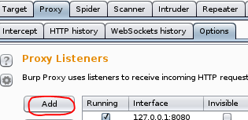

For HTTP traffic, we bind BurpSuite to port 80 (i.e. ```burp_http_port``` in our ```iptables``` rules) on all interfaces.


We go to the request handling tab and enable support for [invisible proxying](https://portswigger.net/burp/help/proxy_options_invisible.html). This is necessary, as the clients are unaware of BurpSuite's existence.

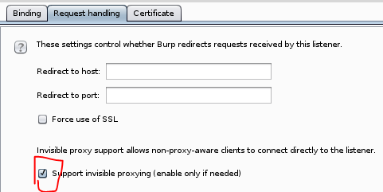

For HTTPS traffic, we bind BurpSuite to port 443 (i.e. ```burp_https_port``` in our ```iptables``` rules) on all interfaces.

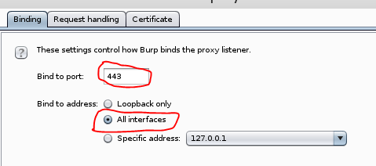

We go to the request handling tab, redirect traffic to port 443, force use of SSL, and enable support for invisible proxying.


## Automation
As we are lazy, we automate anything that we are going to do more than once. You can find the [configuration files](https://github.com/koenbuyens/kalirouter/tree/master/conf) and the [script](https://github.com/koenbuyens/kalirouter/blob/master/monitor.sh) on [my github](https://github.com/koenbuyens/kalirouter).

To get up and running do the following.
1. install the necessary dependencies:
```shell
apt-get install dnsmasq hostapd bridge-utils iptables
```
- Plugin the USB interfaces and discover their name by executing ```iptables -a```.
- Modify the ```hostapd.conf``` file and point it to the correct interface for wireless (default ```wlan0```).
- Modify the interface variables in the ```monitor.sh``` script file to point to the correct interfaces. ```WIRELESS_MONITOR_INTERFACE, WIRED_MONITOR_INTERFACE, INTERNET_INTERFACE``` point to the wireless USB adapter, the wired USB adapter, and Kali's VMWare interface respectively. Default is ```wlan0```, ```eth1```, and ```eth0```.
- Modify the proxy variables in the ```monitor.sh``` script file to point to the IP address and port BurpSuite is running on. ```PROXYBOX```, ```PROXYBOX_HTTP_PORT```, and ```PROXYBOX_HTTPS_PORT``` refer to the IP address. HTTP port, and HTTPS port respectively. You **must** modify the IP address of where BurpSuite runs.
- Execute the script
```bash
$ ./monitor.sh
```
- Output is in the ```dumps/output.pcap``` file. You can stop monitoring by pressing Ctrl-C.


## Intercepting Communication from Embedded Devices, Android Apps, and Windows Applications
After starting our monitor script, we can start monitoring the devices and applications that connect to our monitor network.

### Embedded Device
We connect an embedded device to our Monitor Network, either wirelessly or via Ethernet cable. We then let the device do its job. In the example below, our embedded device (```10.0.0.38```) communicates via UDP to a mobile app in our main home network (```192.168.1.230```). We could have connected both devices to our monitor network (```10.0.0.0/8```) to intercept all communication.


### Mobile Applications
Before we can start monitoring mobile applications, we must add the certificate of BurpSuite to the trust store of the Mobile Operating System as most mobile applications (and thick clients) nowadays validate the certificate.

1. We export BurpSuite's certificate by clicking ```Import/export CA certificate``` in the ```Proxy``` tab.  


- We export the certificate as a DER file by selecting the ```Certificate in DER format``` option.  
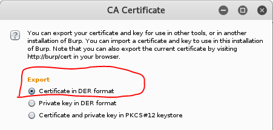

For Android apps, we add the certificate to the trust store of Android as follows.
1. We first go to the security settings.  
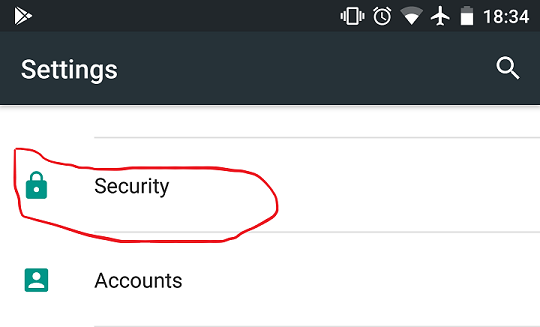

- We then install a certificate from the SD card.  
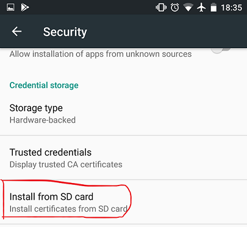

- We select the certificate file.  


- Finally, we give it a name.  
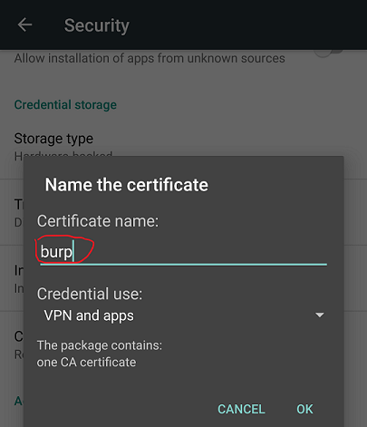

After importing the certificate, we are ready to monitor an application.
1. We connect the mobile device to our Monitor Network. We use the password that we had set-up in our ```hostapd``` configuration file.  
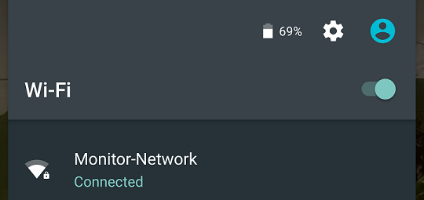

- We then start the application that we want to monitor. The example below shows the Amtrak application.  


- We observe that BurpSuite receives HTTPS traffic from the Android App.  


- We also observe that wireshark logs all traffic (in this case of the Facebook app).  
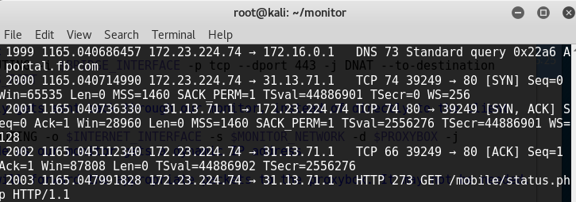

**Note:** To monitor applications that implement [HSTS](https://www.owasp.org/index.php/HTTP_Strict_Transport_Security_Cheat_Sheet), [HPKP](https://developer.mozilla.org/en-US/docs/Web/HTTP/Public_Key_Pinning) or [Certificate Pinning](https://www.owasp.org/index.php/Certificate_and_Public_Key_Pinning), we would need to [complete](https://finnwea.com/blog/bypassing-http-strict-transport-security-hsts) [additional steps](https://github.com/iSECPartners/Android-SSL-TrustKiller) (that are outside of the scope of this article).

### Windows Applications
We can also use this to monitor communication of Windows applications by connecting our Windows machine to the same network and adding BurpSuite's certificate to the Windows trust store.

1. We connect our Windows machine (via Ethernet) to our Monitor network.  


- We follow the steps that [Parsia outlined](https://parsiya.net/blog/2016-02-21-installing-burp-certificate-authority-in-windows-certificate-store/) to import the certificate in the Windows Certificate store.

-  We start the application that we are interested in, in this case just our browser.  


- Observe that both BurpSuite and Wireshark receive the traffic.
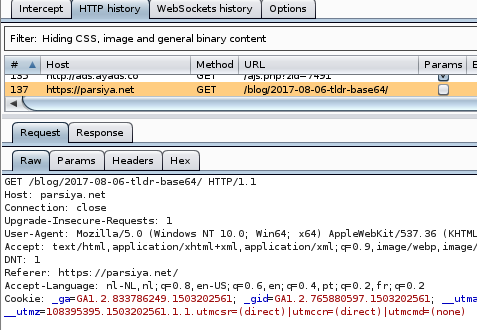
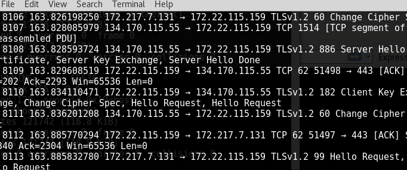

## A Raspberry Pi Kali Router
As we wanted a portable solution, we applied the above set-up on a Raspberry Pi. You can download a Raspberry Pi Kali Linux image with the set-up [here](mailto:koen+raspberrypi@buyens.org). You most likely will need to apply the changes listed in the [Automation](https://github.com/koenbuyens/kalirouter#automation) Section, especially adding the MAC addresses of your cards to the Network Manager configuration file.

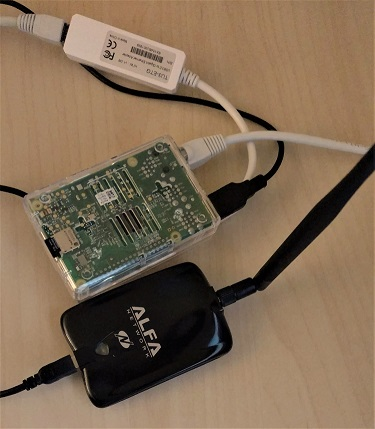

First, we download the latest Kali Linux image for the raspberry Pi at [Offensive Security](https://www.offensive-security.com/kali-linux-arm-images/).
This image is most likely compressed with ```xz```, as it ends with the ```xz``` file extension. We install the ```xz``` compression tool and use it to extract the image. If the Kali image is not compressed with ```xz``` (i.e. it has the ```img``` file extension, we can skip this step).

On MacOSX, this is as follows.
```shell
$ brew install xz
$ xz -d file-to-extract.xz
```

On Ubuntu, this is as follows.
```shell
$ apt-get install xz-utils
$ xz -d file-to-extract.xz
```

Second, flash the image to disk. We execute the ```df``` program twice to identify the disks attached to our system: first before inserting the SD card into the reader and then after inserting it into the reader.
```shell
$ df -h
```
The filesystem name of the SD card is the one that was not there before. On MacOSX, it looks like ```/dev/disk2s1```. On Linux, it looks like ```/dev/sdb```.

We unmount the partition so that we can write to it. On MacOSX, we unmount it with the ```diskutil``` command. As our flash card is the second disk (```/dev/disk2...```), we execute the following.

```shell
$ sudo diskutil unmount /dev/disk2
```

On Ubuntu, we unmount it with the ```umount``` command.
```shell
$ sudo umount /dev/sdb
```

We copy Kali to the SDCard with the ```dd``` command. Replace ```rdisk2``` with the correct disk (i.e. ```/dev/sdb``` in my Kali machine) and replace ```LocationOfKaliImage``` with the path to your Kali Linux machine.

```shell
$ sudo dd bs=1m if=LocationOfKaliImage of=/dev/rdisk2
```

After completion, we insert the SD card into the Raspberry Pi, connect the Pi to a screen, attach a keyboard and mouse, and connect it to our network with an Ethernet cable. We plug in the power source to boot into Kali Linux for the first time and we login with the username "```root```" and the password ```"toor"```.

We expand Kali to take the complete SD card with the ```gparted``` application. We could also have used ```resize2fs```.

```shell
$ apt-get install gparted
$ gparted
```

We update the software of the device by running the following commands:
```shell
$ apt-get update
$ apt-get upgrade
$ apt-get dist-upgrade
```

We update the root password by executing ```passwd```.

```shell
$ passwd root
```

To communicate with our Raspberry Pi from our computer, we will use SSH. As it is not installed, we will install and enable it on boot as follows:

```shell
$ apt-get install openssh-server
$ update-rc.d -f ssh remove
$ update-rc.d -f ssh defaults
```

We change the default keys as follows:

```shell
$ cd /etc/ssh/
$ mkdir insecure_old
$ mv ssh_host* insecure_old
$ dpkg-reconfigure openssh-server
```

We change the ```sshd_config``` file to allow our root user to authenticate. (Note, this is not secure; it is better to create a regular user).

```shell
$ nano /etc/ssh/sshd_config
```

We change the following line.
```shell
PermitRootLogin without-password
```

to this line instead:
```shell
PermitRootLogin yes
```

We save our changes and restart the openssh-server.
```shell
$ service ssh restart
$ update-rc.d -f ssh enable 2 3 4 5
```

We want to install  ```net-tools``` so that we are able to use ```ifconfig```.
```shell
$ apt-get install net-tools  
```

We then check out our scripts on the raspberry Pi, connect our USB adapters, follow the instructions in the [Automation](#automation) section (use ```wlan1``` instead of ```wlan0```), and are ready to go.
```shell
$ git clone https://github.com/koenbuyens/kalirouter.git
```

## Conclusion
We transformed Kali into an intercepting router so that we can easily intercept communication between multiple devices.

## References
The following links helped me creating a wired/wireless router in Kali Linux.
- [https://www.psattack.com/articles/20160410/setting-up-a-wireless-access-point-in-kali/](https://www.psattack.com/articles/20160410/setting-up-a-wireless-access-point-in-kali/)
- [https://cybergibbons.com/security-2/quick-and-easy-fake-wifi-access-point-in-kali/](https://cybergibbons.com/security-2/quick-and-easy-fake-wifi-access-point-in-kali/)
- [https://ubuntuforums.org/showthread.php?t=716192](https://ubuntuforums.org/showthread.php?t=716192)
- [https://help.ubuntu.com/community/NetworkConnectionBridge](https://help.ubuntu.com/community/NetworkConnectionBridge)
- [https://wiki.archlinux.org/index.php/Internet_sharing#Configuration](https://wiki.archlinux.org/index.php/Internet_sharing#Configuration)
- [https://wiki.archlinux.org/index.php/software_access_point#Bridge_setup](https://wiki.archlinux.org/index.php/software_access_point#Bridge_setup)
- [https://wiki.debian.org/BridgeNetworkConnections#Manual_bridge_setup](https://wiki.debian.org/BridgeNetworkConnections#Manual_bridge_setup)
- [https://help.ubuntu.com/lts/serverguide/network-configuration.html](https://help.ubuntu.com/lts/serverguide/network-configuration.html)
